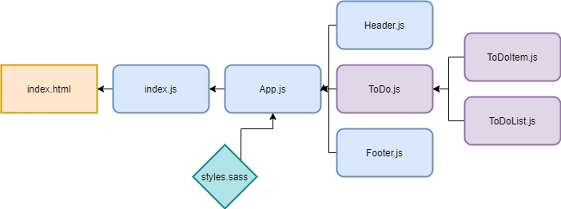
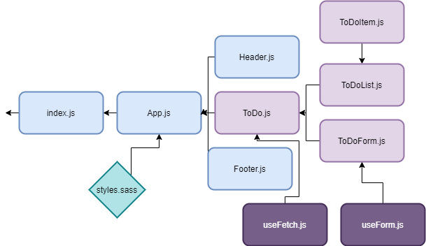

# LAB - Class 27
## ToDo-React

### Author: Madison Stehle

### Links and Resources

- [submission PR](https://github.com/madisonstehle/ToDo-React/pull/3)
- [ci/cd github actions](https://github.com/madisonstehle/ToDo-React/actions)
- [netlify deployed site](https://hungry-joliot-61928d.netlify.app/)

### Setup

#### How to initialize/run the application

- `npm start` if running locally

#### Tests

- `npm test` will run tests for App and Counter

### UML

